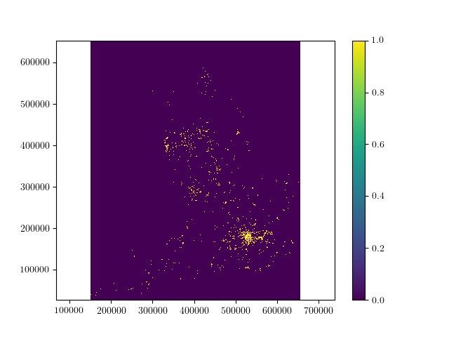

# Flood Risk Prediction tool

## Deadlines
-  **Code: 12pm GMT Friday 24th November 2023**
-  **Presentation and one-page report: 4pm GMT Friday 24th November 2023**

You should update this document in the course of your work to reflect the scope and abilities of your project, as well as to provide appropriate instuctions to potential users (and markers) of your code.

### Key Requirements

Your project must provide the following:

 1. at least one analysis method to estimate a number of attributes for unlabelled postcodes extrapolated from sample data which is provided to you:
    - Flood risk from rivers & seas (on a 10 point scale).
    - Flood risk from surface water (on a 10 point scale).
    - Median house price.
 2. at least one analysis method to estimate the Local Authority & flood risks of arbitrary locations. 
 3. a process to find the rainfall and water level near a given postcode from provided rainfall, river and tide level data, or by looking online.
 4. visualization and analysis tools for the postcode, rainfall, river & tide data provided to you, ideally in a way which will identify potential areas at immediate risk of flooding by combining the data you have been given.
 
 Your code should have installation instructions and basic documentation, as docstrings for functions & class methods, as a full manual or ideally both.





This README file *should be updated* over the course of your group's work to represent the scope and abilities of your project.

### Assessment

 - Your code will be assessed for its speed (both at training and prediction) & predictive accuracy.
 - Your code should include tests of its functionality.
 - Additional marks will be awarded for maintaining good code quality and for a clean, well-organised repository. You should consider the kind of code you would be happy to take over from another group of students.

### AI usage

Generally, GitHub CoPilot and ChatGPT were used in the development, testing, and documentation of this code.
Full references and information can be found in the references file

### Software Installation Guide

The installation instructions for this software and its dependencies can be found in the documentation generated by the steps specified below for Sphinx documentation. The specific instructions will then be generated as an html file as per the Sphinx functionality.

### User instructions

The user instructions for this software and its dependencies can be found in the documentation generated by the steps specified below for Sphinx documentation. The specific instructions will then be generated as an html file as per the Sphinx functionality.

### Documentation

The code includes a basic [Sphinx](https://www.sphinx-doc.org) documentation. On systems with Sphinx installed, this can be built by running

```bash
python -m sphinx docs html
```

then viewing the generated `index.html` file in the `html` directory in your browser.

### Testing

The tool includes several tests, which you can use to check its operation on your system. With [pytest](https://doc.pytest.org/en/latest) installed, these can be run with

```bash
python -m pytest --doctest-modules flood_tool
```

### Reading list

 - [A guide to coordinate systems in Great Britain](https://webarchive.nationalarchives.gov.uk/20081023180830/http://www.ordnancesurvey.co.uk/oswebsite/gps/information/coordinatesystemsinfo/guidecontents/index.html)

 - [Information on postcode validity](https://assets.publishing.service.gov.uk/government/uploads/system/uploads/attachment_data/file/283357/ILRSpecification2013_14Appendix_C_Dec2012_v1.pdf)


 https://ideal-postcodes.co.uk/guides/uk-postcode-format
 
